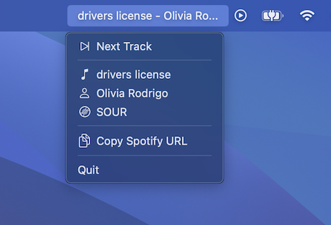

#  SoundSeer
SoundSeer is a macOS menu bar app that shows your currently playing song, and allows you to skip a track, click straight to the song/artist/album, and copy the URL for sharing.

## Compatibility
- macOS 13+
## Download
- [Mac App Store](https://apps.apple.com/us/app/soundseer/id6497167012?mt=12)
## Feedback
Please file an issue with any feedback (even a thank you!). You can also email the author at: his firstname [at] lastname [dot] net.
